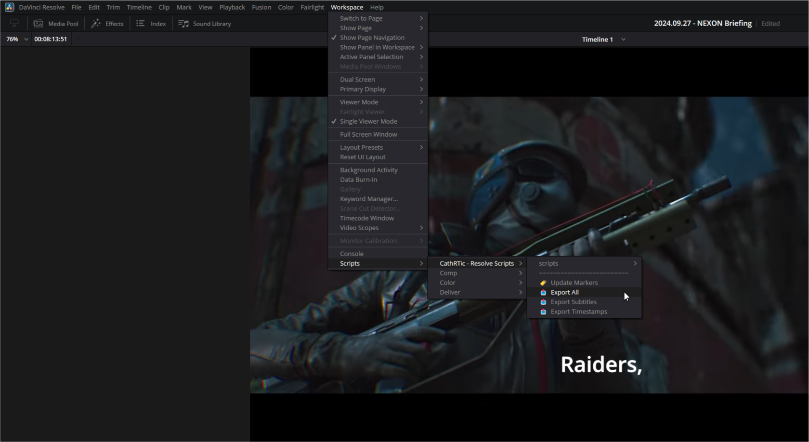
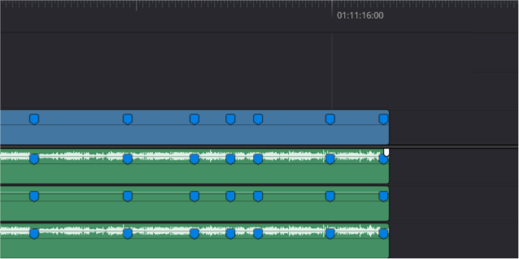
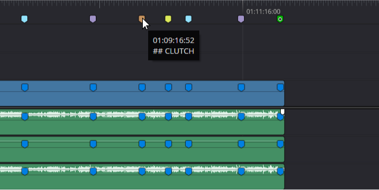

# DaVinci Resolve Scripts
<!-- <div>
    <picture></picture>
    <div>
        <a href="https://ko-fi.com/CathRTic_tv"></a>
    </div>
</div> -->

<br>

<p align="center">
    <a href="#installation-and-usage-guide">Installation and Usage</a>
    <br>
    <a href="#exporting-subtitles">Subtitles</a> •
    <a href="#exporting-timestamps">Timestamps</a> •
    <a href="#exporting-thumbnails">Thumbnails</a> •
    <a href="#updating-markers">Markers</a>
</p>

<br>

My DaVinci Resolve scripts, designed to streamline editing and uploading.
- Export Subtitles and Timestamps as `.json` files for use in custom content management systems.
- Generate Timeline Markers from Chapters prefixed with `"## "` and applied colors based on a configured `.env` file.


<br>

## Installation and Usage Guide
To install these scripts, download and extract this project, then move it into your DaVinci Resolve Scripts folder.

On Windows, this is typically located at:\
`%AppData%/Blackmagic Design/DaVinci Resolve/Support/Fusion/Scripts/Utility/`

<br>

> [!NOTE]
> This project requires you to create and configure a `.env` file, using `.env.example` as a reference.\
> The value of `OUTPUT_PATH` should be an absolute path.

<br>

To run the scripts, open your project and navigate to:\
`Workspace > Scripts > CathRTic - Resolve Scripts > [Script to run]`

<p align="center">
    
</p>

You can also assign these scripts to keyboard shortcuts by going to:\
`DaVinci Resolve > Keyboard Customization > Commands > Application > Workspace > Scripts > CathRTic - Resolve Scripts > [Script to run]` 


<br>

## Exporting Subtitles
When running `"📤 Export All"` or `"📤 Export Subtitles"`, every Subtitle Track will be processed and exported as a series of `.json` files saved to: `[OUTPUT_PATH]/[Project Path]/[Project Name]/Metadata/`.

Subtitle Tracks named `"Subtitle 1"` or `"English"` (case insensitive) will be outputted as `subtitles.json`.\
All other Subtitle Tracks, for example `"French"`, will be outputted as `subtitles.french.json`.

<br>

Example `subtitles.json`:
```json
[{
    "text":"[audience welcoming applause]",
    "startHours":1,
    "startMinutes":0,
    "startSeconds":0,
    "startMilliseconds":0,
    "endHours":1,
    "endMinutes":0,
    "endSeconds":3,
    "endMilliseconds":566
  },{
    "text":">> SVEN GRUNDBERG: Thank you Junghun.\nAnd, hello everybody.",
    "startHours":1,
    "startMinutes":0,
    "startSeconds":7,
    "startMilliseconds":800,
    "endHours":1,
    "endMinutes":0,
    "endSeconds":10,
    "endMilliseconds":766
  },{ ...
```


<br>

## Exporting Timestamps
When running `"📤 Export All"` or `"📤 Export Timestamps"`, every `Cream` colored Timeline Marker (including Cream alt-colored Timeline Markers) will be exported as `timestamps.json` saved to: `[OUTPUT_PATH]/[Project Path]/[Project Name]/Metadata/`.

<br>

Example `timestamps.json`:
```json
[{
    "text":"Introduction",
    "startHours":1,
    "startMinutes":0,
    "startSeconds":0,
    "startMilliseconds":0
  },{
    "text":"Background",
    "startHours":1,
    "startMinutes":0,
    "startSeconds":50,
    "startMilliseconds":133
  },{ ...
```


<br>

## Exporting Thumbnails
When running `"📤 Export All"` or `"📤 Export Thumbnails"`, every `Cocoa` colored Timeline Marker (including Cocoa alt-colored Timeline Markers) will be processed to export a `.png` Frame Still saved to: `[OUTPUT_PATH]/[Project Path]/[Project Name]/Thumbnail/`.

Frame Stills are named with the format `FRAME STILL HH-MM-SS-FF.png`, where HH-MM-SS-FF represents the Timeline timecode in hours, minutes, seconds, and frames.


<br>

## Update Markers
When running `"🏷️ Update Markers"`, each Marker (or `.mp4` Chapter) prefixed with `"## "` in your project's Timeline Items gets copied to the main Timeline.

A generated Marker's color is picked from the `MARKER_[COLOR]` `.env` variables, with `_ALT` colors having a black dot in the middle. These are case insensitive, although the resulting Marker will always be uppercase. If a color is not found, the Marker defaults to Blue.

<br>

Example generated Markers:
<table align="center">
    <tr>
        <th>BEFORE</th>
        <th>AFTER</th>
    </tr>
    <tr>
        <td>
            
        </td>
        <td>
            
        </td>
    </tr>
</table>

> [!NOTE]
> Generated Markers will never override existing Markers on the Timeline
